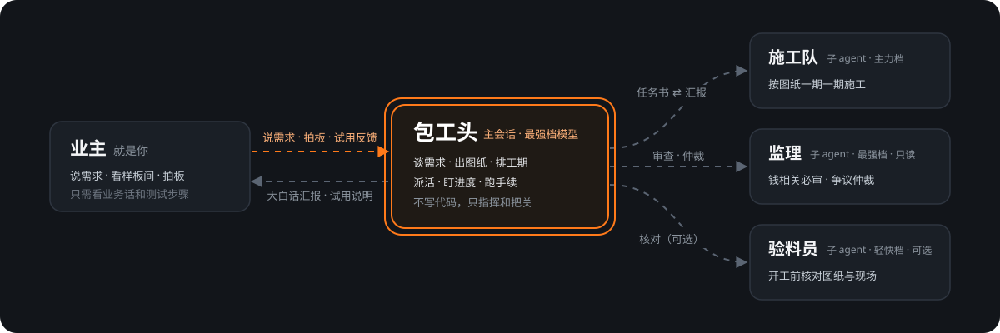

<p align="center">
  
</p>

<p align="center">
  
  
  
</p>

<p align="center"><b>一句话唤起：“用包工头方式完成这套需求。”</b></p>

一个**与项目解耦**、面向 vibe coding 的 Agent Skill。包工头先和你（业主）把需求谈清楚、出图纸、排工期，先做样板间给你看，再派施工队按“你能用上的功能”分批施工、请监理把关，大功能完工就把程序打开让你试，最后交付并留下交接单。

## 它解决什么问题

| 你可能遇到过 | 包工头怎么做 |
|---|---|
| 讨论完需求，AI 按自己的理解写，越写越偏 | 你一说“就这么定了”就强制走流程：原话留证、决定入账，AI 不替你做主 |
| 改个小地方，也被拉去写一整套需求文档 | 唤起后先分诊：小活直接做，中活只写一份任务书派施工队，大活才走完整流程 |
| 本以为是小改动，越改越大，AI 还在主会话里硬写 | 出现升级信号自动升级成包工头：已改的保留，剩下的派施工队 |
| 一口气做完后端，才发现页面不对，全套返工 | 先做可交互的样板间；**视觉确认门槛线**只拦施工、不拦文档 |
| 期次越拆越细，做了很久还是什么都用不上 | 按“交付包”推进，进度只报“几个功能已能用”；拆分有熔断 |
| 要你拍板的事被刷屏顶走，AI 越问越简略 | 《待您决定》固定编号、原样复制提问，每条消息最后都挂着 |
| 想离开电脑让 AI 自己做完，又怕它乱来 | **全自动模式**：不打断你，红线操作跳过，回来看决策报告 + 验收报告 |

## 一次对话长什么样

<p align="center">
  
</p>

## 全流程

<p align="center">
  
</p>

- **文档一次写完，施工分段放行**：主需求文档和全部期次一次写到位，没经你看过的结论标“待视觉确认复核”；真正被拦住的只有后端施工。
- **大功能完工即试用**：原型期或一个带来新页面、新流程的功能包做完，包工头直接把程序启动好、打开到要测的那一页，给你不超过 7 步的测试步骤和不超过 4 条注意事项。修 BUG、改文案这类小调整不打扰你。

## 先分诊：小活、中活、大活

不是所有改动都要写需求文档。包工头被唤起后先判断活的大小（你明确说“包工头”“写需求文档”“拆期”时照做，不分诊）：

| 档位 | 怎么判断 | 怎么做 |
|---|---|---|
| **小活** | 同时满足：一处改动、一次对话改得完；不新增页面或流程；不改钱、权限、删除、数据迁移的规则；不推翻已定的事 | 不启动包工头、不写文档，直接改；第一句告诉你“判断为小改动” |
| **中活** | 同样不碰新页面新流程、不碰钱权限等规则，需求已说清，但要改好几个文件或前后端联动，一期能做完 | **速办派工**：不写需求文档，包工头写一份任务书（引用你的原话和验收标准）派施工队做，做完给你简报 |
| **大活** | 任一：新页面或新流程；改钱、权限、删除、迁移的规则；推翻已定的事；需求还要多轮取舍；一期做不完 | 完整流程（见上图） |

**中途自动升级**：只看**同一件事**有没有越做越大。在一个对话里接连修好几个互不相关的小问题很正常，每件单独判断、不累计，不会因为件数多就升级。同一件事（在上一次的结果上接着改、为同一个目标）出现以下任一情况，AI 自动升级为包工头，用一句话告诉你为什么升、升到哪一档，不用你同意——施工队用主力档模型写代码，本身就省额度：

1. 你在这件事上连续追加修改 3 轮以上，而且范围越来越大（只是反复微调不算）；
2. 动手后发现这件事要改的远超预想：要跨前后端或数据库，一次对话改不完；
3. 发现这件事要改钱、权限、删除、数据迁移的规则；
4. 这件事和已有需求文档里定过的事冲突，或冒出几个要你取舍的业务选项。

升级时先把已改好的存档，已改完的保留不推倒重做；你已经在真实页面上看过并认可的部分算已确认，不补做原型。升到完整流程时照常写完文档再问你开不开工。你也可以随时说“转包工头”。

> 关键词唤起只能看你当前这一句话，看不出“工作量变大了”，所以第 1、2 条主要靠 AI 按 skill 简介自己察觉；最稳的兜底是你直接说“转包工头”。

## 工地分工

<p align="center">
  
</p>

包工头只指挥、不写代码：规划、查实关键事实、派活、沟通、跑手续（部署等线上操作）和交接都由它亲自做；凭据不交给子 agent，花钱和不可撤回的操作先问你。

## 两种运行模式

<p align="center">
  
</p>

**半自动（默认）**：你在电脑前时用。什么都不用说，默认就是它。

**全自动**：要长时间离开时，说“全自动模式”：

1. **自检**：包工头逐条检查能不能开，列出 ✅ / ❌。**视觉没经你确认就不能开**——视觉是开发的底座和方向，不确认就可能全套返工，它会引导你先用半自动把原型看完。
2. **讲清注意事项**：哪些会自动定、哪些会跳过、电脑不能休眠、会话要处于自动模式。
3. 你回“确认开启”后离开。期间要拍板的事它按自己的建议定、逐条记录；花钱、正式上线、删除数据等红线操作一律跳过留给你；每个功能包做完派人按测试步骤自己走一遍、留证据。
4. **结束时**推送通知，交《决策报告》（每个决策的理由、其他选项、推翻代价、可回退的版本）和《验收报告》，并把试用程序打开给你。

## 适配对象

需求编写部分适用于任何能加载 Agent Skill 的工具。包工头施工需要工具支持**子 agent 并能给子 agent 指定模型**：

| 工具 | 包工头 / 监理（T1 前沿档） | 施工队（T2 主力档） | 验料员（T3 轻快档，可选） | 指定模型的方式 |
|---|---|---|---|---|
| **Claude Code** | Opus | Sonnet | Haiku | 派活时写系列别名（`opus` / `sonnet` / `haiku`），自动对应最新一代 |
| **OpenAI Codex** | Astra | Sol | Luna | 项目 `.codex/agents/` 下的角色文件（本仓库 `templates/codex-agents/` 提供） |

- skill 里只写**模型系列名，不写版本号**，升级模型不会让施工卡住，见 `references/model-roles.md`。
- Codex 若设成完全放开权限，不会替你拦危险操作，所以“哪些操作必须先问你”“凭据不交给子 agent”这些规则**写死在流程里**，不依赖工具兜底。
- 不支持子 agent 的工具：照常写需求；施工退回“每期单独开窗口”的手动方式。

## 安装

### Claude Code

```bash
git clone https://github.com/yinweb49-sudo/baogongtou.git ~/.claude/skills/baogongtou
```

> Windows PowerShell：`git clone https://github.com/yinweb49-sudo/baogongtou.git "$env:USERPROFILE\.claude\skills\baogongtou"`

或作为项目子模块（团队 / 多机、版本可控）：

```bash
git submodule add https://github.com/yinweb49-sudo/baogongtou.git .claude/skills/baogongtou
```

### Codex

```bash
git clone https://github.com/yinweb49-sudo/baogongtou.git ~/.codex/skills/baogongtou
```

> Windows PowerShell：`git clone https://github.com/yinweb49-sudo/baogongtou.git "$env:USERPROFILE\.codex\skills\baogongtou"`

施工前把角色文件复制进项目（随仓库提交，团队共用）：

```bash
mkdir -p .codex/agents && cp ~/.codex/skills/baogongtou/templates/codex-agents/*.toml .codex/agents/
```

角色文件里的 `model` 是占位符：开工时包工头会按系列名（Sol / Astra / Luna）填入当前最新型号并告诉你。没有角色文件时，Codex 子 agent 会继承包工头的最强模型做开发，额度消耗明显变大。

### 关键词强制唤起（推荐，需手动开启）

skill 是否被唤起，由 AI 读 skill 简介后自己判断；装的 skill 多时，Claude Code 还会把简介截短（默认所有简介合计只占上下文约 1%）。所以光靠简介不够稳，尤其是讨论完需求说“就这么定了”时，AI 容易直接按自己的理解写。安装 skill **不会**自动改你的配置，下面这一步要你自己加。

**Claude Code**：在用户级 `~/.claude/settings.json` 的 `hooks.UserPromptSubmit` 数组里加一项（保留已有的项，路径换成你的安装位置）：

```json
{
  "hooks": [
    {
      "type": "command",
      "command": "node \"C:/Users/<你>/.claude/skills/baogongtou/hooks/baogongtou-trigger.cjs\"",
      "timeout": 10
    }
  ]
}
```

之后每条消息都会过一遍关键词：命中“写需求、需求文档、PRD、拆期、包工头、全自动模式”等说法，强制 AI 先加载包工头（只是顺口提到“需求文档”这类字眼时，加载后先分诊）；命中“就这么定了、按这个方案来、可以开工”等确认的话，由 AI 先判断是不是小活，小活直接做，不是小活才加载。AI 第一句会告诉你分诊结果，或“已开启包工头模式”。在本仓库里维护 skill 时不会触发。需要本机装有 Node.js。

**Codex**：把 `SKILL.md` 简介里的触发说法写进全局 `~/.codex/AGENTS.md` 作为硬规则（加载 `$baogongtou`、第一句声明已开启包工头模式）。

## 使用

**唤起**：最稳的是直接输入 `/baogongtou`（Claude Code）或 `$baogongtou`（Codex）；也可以说“包工头”“用包工头方式完成这套需求”，说写需求类的话（写需求、需求文档、PRD、拆期），或讨论完功能后说“需求确认了”“就这么定了”“按这个方案来”。

1. **建项目档案**：复制 `references/project-profile-template.md` 到你的项目（仓库根、`.agents/` 或 `docs/`），改名为 `requirements-profile.md` 按提示填空，可参考 `examples/example-profile.md`。没建档案也能用，skill 会退而读 `CLAUDE.md` / `AGENTS.md` / `README.md`。
2. **写需求**：用最强档模型开会话唤起包工头。它先分诊（小活直接做、中活速办派工）；大活读档案 → 选文档强度 → 建证据与决策 → 一次写完主需求文档和全部期次 → 自检后问你是否开工。
3. **开工**：说“开工”或“从期 N 开工”。包工头先给分批计划，再逐期派施工队；大功能完工时打开试用程序给你测试步骤；要你拍板的事记进《待您决定》按编号问你。要离开时说“全自动模式”。
4. **接手**：会话变长或换电脑时，包工头写好《包工头工作记录》并给出开场提示词，开新窗口粘贴即可继续。

产出结构（只有大活产出；速办只有一份任务书，放会话临时目录，不进仓库）：

```text
docs/<功能名称>/
├── 00-需求证据与原话参考.md        # 标准 / 审计模式的历史证据
├── <功能名称>-开发需求文档.md      # v0.9 待视觉确认基线 → v1.0 已确认开发基线
├── 待您决定.md                     # 施工中要你拍板的事，固定编号
├── 包工头工作记录-第N轮-*.md       # 每轮施工一份，供接手
├── 全自动决策报告 / 验收报告-*.md  # 仅全自动模式
└── 开发提示词/
    ├── README.md                   # 期次总览、视觉确认门槛线、施工指挥基线
    ├── 期0-技术探针.md              # 仅技术事实阻塞视觉成立时
    ├── 期1-前端原型与视觉确认.md    # 从无到有且有界面时必须
    └── 期N-*.md                    # 门槛线之后的期次，与前端期一次写完
```

## 核心设计

<details>
<summary><b>通用引擎 + 项目档案</b>：一套方法论，适配任何项目</summary>

- **通用引擎**（本仓库全部内容）：方法论和模板，不含任何具体项目的路径、术语、端口。
- **项目档案**（`requirements-profile.md`，留在你自己的项目里）：一次性声明架构分层、数据库、鉴权、验收方式、试用唤起方式、样本文档，以及施工约定（开发工具、测试纪律、端口分配、红线操作执行人、必审范围）。

skill 运行时先读项目档案，把模板里的占位符（`{{前端}}`、`{{本地后端}}`、`{{主库}}`、`{{鉴权方案}}`、`{{验收方式}}` 等）替换成真实值。**项目里不存在的层 / 库 / 机制会被自动裁剪，不会硬套三层架构。**

</details>

<details>
<summary><b>阶段一：需求编写</b>：原话可追溯、视觉先行、按交付包拆期</summary>

- **先分诊**：小活直接做、中活只写任务书派施工队、大活才写文档；小活越改越大时自动升级，已改的保留。
- **分级证据档案**：轻量需求只保留关键原话；标准 / 审计模式保留完整证据、强调、否定和冲突。敏感信息始终脱敏。
- **当前决策台账**：原话负责举证，当前有效的 `D-xxx` 才指导开发；旧决定保留历史和替代关系。
- **编号追溯与销账**：需求、代码事实、决定和期次使用 `U/P/A/E/D` 编号，标准 / 审计模式做到零“无归属”。
- **业务共识**：每份主需求文档开头用大白话写清原始诉求、AI 理解的最终效果和多轮沟通中的冲突；原话矛盾时把两端原话贴给你选，AI 不替你取舍。
- **范围闸门**：每项功能和期次都要有明确需求或必要配套依据，模板示例不自动进入范围。
- **视觉先行**：从无到有且有界面时，先用正式前端代码 + 可替换的模拟数据做可交互原型；确认绑定版本、页面入口和截图。
- **交付包优先**：先列你能实际用上的交付包，第一个交付包就打通真实端到端链路，单个交付包不超过 4 期。
- **AI 执行分期**：按变更面、跨层依赖、不确定性、数据风险、验收复杂度和上下文负载评分，普通期 4–7 分；过重先减负、再换方案、最后才拆，且只拆一层。
- **相称原则**：防御和校验只做真实数据量级、真实事故、你明确要求、钱 / 权限攻击场景需要的部分。
- **Git 代码检查点**：按项目档案选择保存策略；远程存在不等于允许推送；真实密码、令牌、私钥一律阻止进入 Git。

</details>

<details>
<summary><b>阶段二：包工头施工</b>：每条规则都来自真实事故或实测</summary>

来自一个 30 余期真实项目的 6 轮施工记录，详见 `references/foreman-workflow.md`。

- **包工头只指挥**：最强模型负责规划、查实、派活、沟通和进度，不写代码、不重做验收。
- **批次与额度**：开工给出分批计划，停点选在交付包结束处；你给了额度上限时按实测消耗估算、设刹车线。
- **标准任务书**：必读路径、范围与地盘、测试纪律、Git 纪律、红线、交付格式；只给路径不粘全文。
- **测试省着跑**：开发中只跑相关测试，收尾全量一次，失败只修只重跑失败项。
- **并行看地盘**：同层同文件不并行；能并行时按目录划地盘。
- **钱相关必审**：涉及钱的期次做完派监理独立审查（实战中两次各挖出 1 个高危问题）；监理意见分“阻断 / 记录”两级，不变成新子期。
- **线上操作 AI 直接做**：部署、服务器配置、后台录入由包工头完成，不把命令甩给你；全量发版、花钱、动共用设施、不可撤回的删除先问你。
- **大功能完工即试用**：只在大功能完工时唤起，小修小补不打扰你；唤起后等你反馈再开下一个交付包。
- **《待您决定》**：固定编号、原样复制提问；卡住施工的弹窗问并推送提醒；不急的到期按建议先做、等你追认；施工期间不刷过程动态。
- **拆分熔断**：同一期第二次需要拆、交付包超过 4 期未交付、连续 3 期你仍用不上新功能、或你质疑进度时，停下复盘，给你“简化方案 vs 原方案”让你选。
- **进度说人话**：按“交付包 x / y 已可用”汇报，总览、简报、交接正文不出现哈希和代码术语。
- **轮次交接**：派了约 8–10 次施工任务或上下文快满时主动交接，亲自写《包工头工作记录》并推送，直接给你“用哪个模型开新窗口 + 粘贴这段”。

</details>

<details>
<summary><b>目录结构</b></summary>

```text
baogongtou/
├── SKILL.md                              # skill 主文件：两阶段路由、方法论、工作流
├── agents/openai.yaml                    # Codex 界面里的显示名称与默认提示
├── assets/                               # README 用的动态示意图
├── hooks/
│   └── baogongtou-trigger.cjs            # 【可选】Claude Code 关键词强制唤起
├── references/
│   ├── raw-requirements-template.md      # 需求证据与原始描述（证据编号 + 决策追踪）
│   ├── visual-first-workflow.md          # 最小业务草案 → 可交互原型 → 视觉确认门槛
│   ├── requirements-doc-template.md      # 主需求文档模板
│   ├── phase-prompt-template.md          # 分期开发提示词模板（含施工指挥基线、试用说明）
│   ├── phase-workload-planning.md        # AI 工作量评分、上下文边界与动态拆期
│   ├── git-backup-workflow.md            # 代码检查点、远程授权边界与业务回退
│   ├── foreman-workflow.md               # 【施工】每期循环、试用、并行、审查、沟通、交接
│   ├── full-auto-mode.md                 # 【施工】全自动模式：自检、替代规则、两份报告
│   ├── pending-decisions-template.md     # 【施工】《待您决定》模板
│   ├── model-roles.md                    # 【施工】角色分级与模型系列对照
│   ├── dispatch-brief-template.md        # 【施工】开发 / 核对 / 审查 / 仲裁任务书
│   ├── foreman-handoff-template.md       # 【施工】包工头工作记录与开场提示词
│   ├── review-checklist.md               # 需求 / 提示词 / 施工评审清单
│   └── project-profile-template.md       # 【新项目填这个】项目档案模板
├── templates/codex-agents/               # Codex 角色文件：施工队 / 监理 / 验料员
└── examples/example-profile.md           # 填好的示例项目档案（虚构）
```

</details>

<details>
<summary><b>维护与发布策略</b></summary>

- 本仓库由单一维护者维护。用户明确要求“发布 / 同步”时，直接提交并推送到 `main`，不默认建功能分支或 Pull Request。
- 只有明确要求代码评审、草稿 PR 或隔离开发时，才使用独立分支和 Pull Request。
- 推送成功后同步本机 Claude Code 与 Codex 的安装目录，保证本地使用版本与 `main` 一致。
- skill 内只写模型系列名；工具新增或撤下某个系列时，才更新 `references/model-roles.md` 和上面的适配对象表。
- 分支保护或权限阻止推送时，停止并说明原因，禁止强推绕过。

</details>

## 许可

MIT License，见 `LICENSE`。
